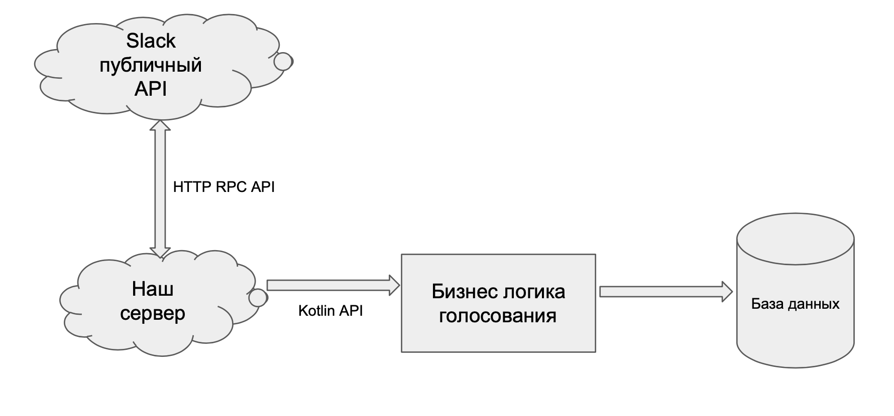
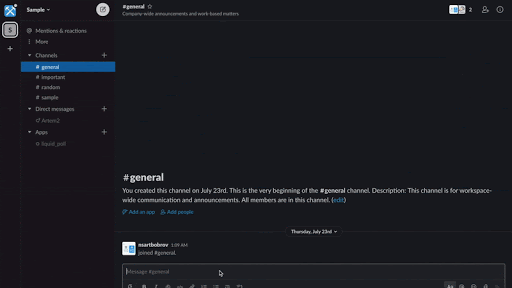

# Архитектура

## Базовая архитектура

## Используемые технологии

* Kotlin
* Spring
* Java Slack SDK
* PostgeSQL

## Webhooks

Slack запрашивает некоторую информацию по нужным событиями (например, нажатие на кнопку, запрос действия по команде и т.д.). К коде определяется понятие `Action`, которое и вызывется по команде.

За `Action` стоит некоторая иерархия, которая позволяет регулировать ответ в зависимости от вызываемого контекста.
Slack public API устроено неоднородным образом, то есть в зависимости от того, является ли событие ответ на команду, нажатие на кнопку в сообщении или в модальном окне на наш сервер будет отправляться разная информация. Эта иерархия позволяет за этим следить.

## UI

Slack предоставляет свой фреймворк для разработки интерфейсов сообщений, состоящий из готовых компонентов.

В коде реализована дополнительная иерархия классов, целью которой является переиспользование кастомных компонентов. Так как сообщение в чате(BlockView), модальные окна(View) и приложения к сообщениям(Attachment) задаются разными способами, это иерархия позволяет обобщить данные компоненты и использовать их в SlackProvider для отправки запросов по Slack public API.

## Example

